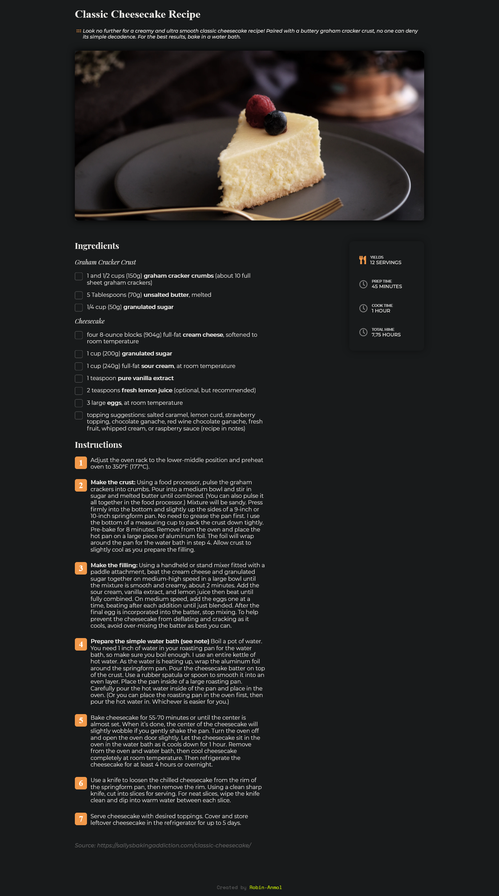
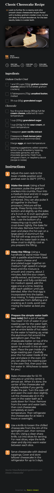

<h1 align="center">{ Cake Recipe Page }</h1>

   Solution for a challenge from  <a href="http://devchallenges.io" target="_blank">Devchallenges.io</a>.

  <h3>
    <a href="https://robin-anmol.github.io/Cake-Recipe-page/">
      Demo
    </a>
     | 
    <a href="https://devchallenges.io/solutions/vljIoFVuChEXR4ZnkpBV">
      Solution
    </a>
     | 
    <a href="https://devchallenges.io/challenges/OEKdUZ6xs0h99C38XVht">
      Challenge
    </a>
  </h3>

<!-- TABLE OF CONTENTS -->

## Table of Contents

- [Overview](#overview)
  - [Built With](#built-with)
- [Features](#features)
- [How to use](#how-to-use)
- [Contact](#contact)

<!-- OVERVIEW -->

## Overview

### Built With

-->HTML
-->CSS PROPERTIES
-->CSS FLEX-BOX
-->ANIMATION

## Features

This application/site was created as a submission to a [DevChallenges](https://devchallenges.io/challenges) challenge.

## Contact

- GitHub [@Robin-Anmol](https://github.com/Robin-Anmol)
